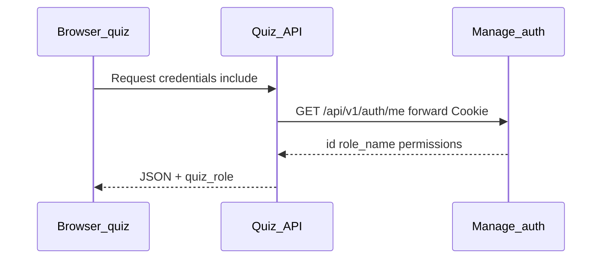

# Tích hợp xác thực (Auth)

## Dịch vụ bên ngoài

- **Đăng nhập**: `POST https://manage.dutai.io.vn/api/v1/auth/login` (body: `email`, `password`) — response đính kèm **cookie** session.
- **Người dùng hiện tại**: `GET https://manage.dutai.io.vn/api/v1/auth/me` — ví dụ `data`: `id` (int), `name`, `email`, `role_name`, `permissions`, …

## Domain & cookie

- **Frontend quiz**: `https://quiz.dutai.site`
- **Auth / quản lý**: `https://manage.dutai.io.vn`
- Vì khác **eTLD+1** (`.dutai.site` và `.dutai.io.vn`), cơ chế chia sẻ Cookie trực tiếp qua domain chung `.dutai.site` sẽ không hoạt động. Dự phòng dùng token qua Header Authorization hoặc BFF (Next.js server).

**Việc cần làm khi triển khai**: xác nhận thực tế header `Set-Cookie` từ manage (`Domain`, `Secure`, `SameSite`).

**Dự phòng** nếu không dùng được cookie chung: token (Bearer) hoặc BFF (Next.js server gọi `/me`).

## Quiz service xác định user

- Middleware/backend quiz gọi `GET .../auth/me` kèm cookie do client forward (hoặc pattern tương đương), lấy **`id`** làm `user_id`.
- Response nội bộ có thể thêm **`quiz_role`**: `teacher` | `student` (map bên dưới).

## Ánh xạ vai trò (manage → quiz)

| `role_name` (manage) | Vai trong quiz |
| ---------------------- | -------------- |
| `admin` | **Teacher** |
| `teammate` hoặc `leader` | **Student** |

Role khác: từ chối hoặc cấu hình rõ sau.

## Luồng tóm tắt

## CORS (gợi ý)

- Cho phép origin `https://quiz.dutai.site`, `credentials: true`, headers cần thiết (`Cookie`, `Authorization` nếu có token fallback).
