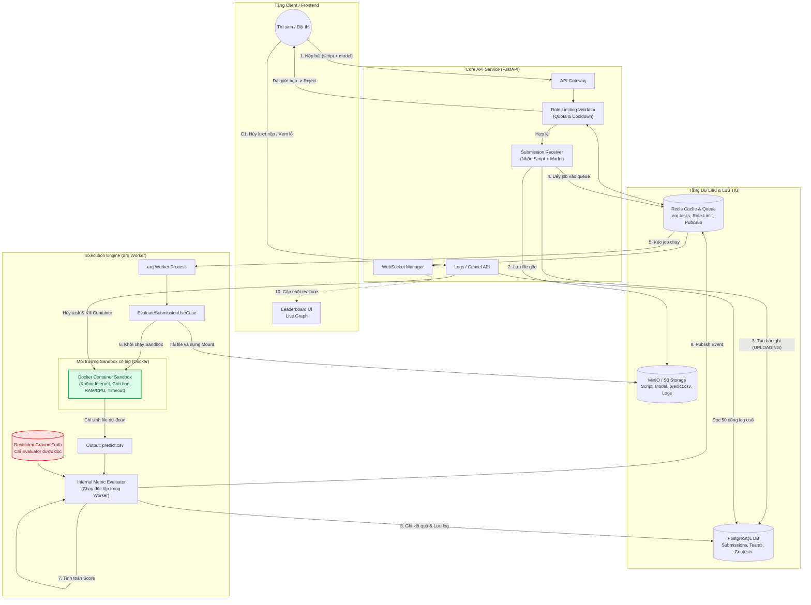

# TÀI LIỆU NGHIỆP VỤ & ĐẶC TẢ KỸ THUẬT (BRD)
## LUỒNG NỘP BÀI VÀ ĐÁNH GIÁ TỰ ĐỘNG (EXECUTION PIPELINE & EVALUATION SYSTEM)

Tài liệu này đặc tả luồng xử lý nghiệp vụ, các ràng buộc hệ thống, tính năng bảo mật, và hướng dẫn kỹ thuật dành cho đội ngũ lập trình (Developers) để phát triển mô-đun chạy thử nghiệm và đánh giá bài nộp của thí sinh trong các cuộc thi AI/Hackathon.

---

## 1. Kiến trúc Tổng quan (System Architecture)

Hệ thống hoạt động bất đồng bộ dựa trên **Message Queue (Redis)** kết hợp với **Worker Service (arq)** và **Docker Engine** làm môi trường Sandbox cô lập để chạy mã nguồn của thí sinh.



---

## 2. Quy trình Xử lý Tuần tự 5 Bước (Execution Pipeline)

Mỗi lần thí sinh nộp bài, hệ thống sẽ thực hiện tuần tự qua 5 trạng thái (Status) dưới đây:

| Bước | Trạng thái (Status) | Thành phần xử lý | Mô tả hoạt động chi tiết | Đầu ra kỹ thuật (Output) |
| :--- | :--- | :--- | :--- | :--- |
| **1** | **Uploading**<br/>*(Đang upload)* | API Gateway & S3/MinIO | Hệ thống tiếp nhận file script (`predict.py`) và file model (`model.bin`/`model.h5`/...) từ client, upload lên MinIO/S3 lưu trữ và kiểm tra tính toàn vẹn của tệp tin. Ghi nhận trạng thái `UPLOADING` vào DB. | File được lưu an toàn trên S3; job được đẩy vào Redis queue (`arq`). |
| **2** | **Extracting and Setup**<br/>*(Giải nén & Chuẩn bị)* | `arq` Worker | Worker nhận job từ hàng đợi. Tải script và model file từ S3 về thư mục tạm thời của worker. Thực hiện giải nén (nếu tệp nén) và chuẩn bị môi trường Docker container cô lập. | Thư mục chạy tạm thời được chuẩn bị sẵn sàng trên Worker. |
| **3** | **Running Model**<br/>*(Chạy mô hình)* | Docker Sandbox | Kích hoạt script `predict.py` của thí sinh bên trong Docker container cô lập. Mount thư mục tạm thời của thí sinh làm thư mục làm việc. Container thực hiện nạp file model dự đoán trên tập dữ liệu kiểm thử ẩn (**Hidden Test Set**) để tạo ra file kết quả dự đoán. | File `predict.csv` được sinh ra trong thư mục mount. **Không có internet, giới hạn RAM/CPU.** |
| **4** | **Evaluating**<br/>*(Đánh giá)* | Metric Evaluator | Chạy độc lập hoàn toàn trong Worker (không nằm trong Sandbox). Lấy file kết quả dự đoán (`predict.csv`) đối chiếu với file đáp án (**Ground Truth**) sử dụng thuật toán metric đã thiết lập của bài tập để tính toán điểm số chính xác. | Điểm số (Score) của lượt nộp bài. |
| **5** | **Publishing**<br/>*(Công bố kết quả)* | Worker & API Service | Ghi nhận điểm số chính thức và thời gian thực thi vào lịch sử nộp bài trong PostgreSQL. Giải phóng tài nguyên tính toán (xóa container, xóa thư mục tạm). Gửi Pub/Sub event qua Redis để đồng bộ dữ liệu trực tiếp lên Leaderboard công khai qua WebSocket. | Trạng thái chuyển thành `PUBLISHED`. Bảng xếp hạng cập nhật realtime. |

---

## 3. Ràng buộc Hệ thống & Bảo mật (Security & System Constraints)

Để đảm bảo hệ thống vận hành an toàn trước các hành vi tấn công mã độc hoặc lạm dụng tài nguyên từ phía thí sinh, lập trình viên **bắt buộc** phải tuân thủ các quy tắc bảo mật sau:

### 3.1. Ngăn ngừa lộ đáp án ẩn (Ground Truth Leak Prevention)
> [!IMPORTANT]
> **Lỗ hổng:** Thí sinh viết script cố tình in nội dung file Ground Truth ra màn hình (`stdout`/`stderr`) rồi gọi `sys.exit(1)` để xem log lỗi từ xa.
> 
> **Cách khắc phục:**
> 1. **Tuyệt đối không mount** hoặc chép file đáp án (`ground_truth.csv`) vào bên trong Docker Container Sandbox ở Bước 3.
> 2. Docker Container chỉ được quyền đọc tập dữ liệu kiểm thử ẩn đầu vào (`hidden_test_input.csv`) và ghi file dự đoán đầu ra (`predict.csv`).
> 3. Quá trình so sánh và tính điểm (Bước 4) phải được chạy ở tiến trình Python nội bộ của Worker bên ngoài Sandbox, nơi có quyền đọc trực tiếp file Ground Truth.

### 3.2. Giới hạn Error Log trả về (Error Log Truncation)
- **Quy định:** Tránh việc thí sinh dump dữ liệu lớn ra log hoặc gây tràn bộ nhớ giao diện.
- **Giải pháp:** Sandbox Worker bắt toàn bộ log lỗi từ stdout/stderr của container. Nếu lượt nộp thất bại (exit code khác 0), Worker sẽ cắt trực tiếp dữ liệu log, **chỉ lấy tối đa 50 dòng cuối cùng (tail -n 50)** trước khi lưu vào DB. Phần log còn lại sẽ bị loại bỏ để đảm bảo an toàn.

### 3.3. Giới hạn Tài nguyên Sandbox (Resource Limits & Timeout)
Cấu hình cứng toàn bộ hệ thống được định nghĩa tập trung trong file cấu hình `config.py`:
- **Time-out:** Giới hạn tối đa **15 phút (900 giây)** cho một lượt chạy container. Quá thời gian này, Worker sẽ kích hoạt lệnh `container.kill()` và đánh dấu trạng thái lượt nộp là `FAILED` với thông báo lỗi Timeout.
- **CPU & RAM Limit:** Giới hạn tài nguyên phần cứng tối đa để ngăn chặn lỗi tràn bộ nhớ (Out-Of-Memory - OOM) làm sập Worker Node hoặc kẹt hàng đợi vĩnh viễn.
- **Internet Blocked:** Cấu hình Docker container chạy ở chế độ mạng cách ly hoàn toàn (`network_mode="none"`) để ngăn thí sinh dùng API gửi dữ liệu/mô hình ra bên ngoài internet.

---

## 4. Kiểm soát Quy trình: Hủy bỏ và Xem lỗi (Cancellation & Debugging)

### 4.1. Cơ chế Hủy lượt nộp (Cancel Submission)
- **Điều kiện:** Thí sinh có quyền bấm nút **"Cancel"** trên giao diện khi lượt nộp đang xử lý ở các bước **1, 2, hoặc 3** (`UPLOADING`, `EXTRACTING`, `RUNNING`).
- **Xử lý phía backend:**
  1. Khi nhận request cancel từ API, hệ thống sẽ kiểm tra trạng thái lượt nộp.
  2. Nếu task đang nằm trong hàng đợi arq, hủy/bỏ qua job đó.
  3. Nếu task đang chạy Docker Sandbox, sử dụng Docker API để tìm container tương ứng với `submission_id` và thực thi `container.kill()` rồi `container.remove()`.
  4. Cập nhật trạng thái lượt nộp trong DB thành `CANCELLED`.
  5. **Quy tắc tính toán:** Lượt nộp bị Hủy chủ động **không bị tính vào số lần nộp tối đa (Max Quota)** của thí sinh/đội.

### 4.2. Cơ chế Xem lỗi (Error Logs)
- Khi một lượt nộp chuyển sang trạng thái `FAILED` (ở bất kỳ bước nào như lỗi giải nén, syntax python, tràn RAM, quá thời gian chạy), hệ thống phải bắt được lỗi đó.
- Trích xuất 50 dòng log cuối cùng đã xử lý ở mục 3.2 hiển thị chi tiết ở phần lịch sử nộp bài của thí sinh để phục vụ sửa lỗi (debugging).

---

## 5. Giới hạn Tần suất & Số lần Nộp bài (Rate Limiting & Quotas)

Để đảm bảo tính công bằng và tránh spam làm nghẽn hàng đợi, hệ thống áp dụng cơ chế tự động:

### 5.1. Khoảng cách giữa các lần nộp bài (Cooldown)
- **Quy định:** Mỗi thí sinh/đội chỉ được phép nộp bài mới sau **5 phút (300 giây)** kể từ thời điểm bấm nộp bài thành công trước đó.
- **Kỹ thuật triển khai:**
  - Khi một lượt nộp được tạo thành công, ghi nhận thời gian nộp vào Redis cache theo key `cooldown:team_id`.
  - API nhận bài nộp (`SubReceiver`) phải check Redis key này trước tiên. Nếu còn trong thời gian cooldown, từ chối nhận bài và trả về mã lỗi `429 Too Many Requests`.
  - Trên giao diện người dùng (Frontend), nút nộp bài sẽ bị vô hiệu hóa (disabled) kèm đồng hồ đênh ngược cho tới khi hết thời gian cooldown.

### 5.2. Số lần nộp bài tối đa (Max Quota)
- **Quy định:** Mỗi đội thi chỉ có tối đa **n lượt nộp bài hợp lệ** cho toàn bộ cuộc thi (Tham số `n` được cấu hình toàn hệ thống).
- **Quy tắc trừ Quota:**
  - **Bị trừ Quota:** Các lượt nộp có trạng thái kết thúc là `PUBLISHED` (thành công có điểm) hoặc `FAILED` do lỗi từ code/mô hình của thí sinh (ví dụ: lỗi chạy script ở Bước 3, lỗi format file dự đoán ở Bước 4).
  - **KHÔNG bị trừ Quota:** Các lượt nộp bị lỗi hệ thống (ví dụ: lỗi server ở Bước 1, 2) hoặc thí sinh chủ động **Hủy (Cancel)** trước khi tính điểm thành công.
  - Khi số lượt nộp đã trừ quota của đội đạt giới hạn `n`, hệ thống sẽ chặn hoàn toàn việc nộp bài mới của đội đó.

---

## 6. Hướng dẫn Lập trình & Đặc tả Kỹ thuật (Developer Reference)

### 6.1. Tham số Cấu hình Hệ thống (`config.py`)
Lập trình viên cần tích hợp các tham số này vào file `app/config.py`:

```python
class Settings(BaseSettings):
    # ... các cấu hình hiện tại ...

    # ================= SUBMISSION SYSTEM CONFIG =================
    # Giới hạn tần suất và số lượt nộp
    SUBMISSION_COOLDOWN_SECONDS: int = 300  # 5 phút cooldown
    SUBMISSION_MAX_QUOTA: int = 20          # Tối đa 20 lượt nộp hợp lệ / cuộc thi

    # Cấu hình Docker Sandbox
    SANDBOX_TIMEOUT_SECONDS: int = 900      # 15 phút timeout chạy model
    SANDBOX_MEM_LIMIT: str = "4g"           # Giới hạn RAM tối đa 4GB cho container
    SANDBOX_CPU_LIMIT: int = 2000000000     # 2 vCPU (nano_cpus = CPU * 1e9)
    SANDBOX_IMAGE_NAME: str = "python:3.12-slim"

    # Giới hạn log lỗi
    LOG_MAX_LINES: int = 50
```

### 6.2. Trạng thái Lượt nộp (`SubmissionStatus` Enum)
Cần định nghĩa đầy đủ các trạng thái của Lượt nộp trong DB và API:

```python
from enum import Enum

class SubmissionStatus(str, Enum):
    UPLOADING = "UPLOADING"      # Đang tiếp nhận và upload file lên S3
    EXTRACTING = "EXTRACTING"    # Đang giải nén và cấu hình thư mục chạy
    RUNNING = "RUNNING"          # Đang thực thi model trong Docker Sandbox
    EVALUATING = "EVALUATING"    # Đang so sánh kết quả dự đoán với Ground Truth
    PUBLISHED = "PUBLISHED"      # Đã đánh giá xong và ghi điểm vào BXH
    FAILED = "FAILED"            # Thất bại tại bất kỳ bước nào (lưu log lỗi)
    CANCELLED = "CANCELLED"      # Đã được thí sinh chủ động hủy bỏ
```

### 6.3. Sơ đồ xử lý trong `arq` Task (`arq_tasks.py`)
Mô phỏng logic xử lý trong worker khi chạy task `evaluate_submission_job`:

```python
async def evaluate_submission_job(ctx, submission_id: str, ...):
    # 1. Chuyển trạng thái sang EXTRACTING
    await update_submission_status(submission_id, SubmissionStatus.EXTRACTING)
    
    # 2. Tải và giải nén script, model từ S3 về local worker temporary directory
    # 3. Chuyển trạng thái sang RUNNING
    await update_submission_status(submission_id, SubmissionStatus.RUNNING)
    
    # 4. Kích hoạt Docker Sandbox với các giới hạn tài nguyên từ config.py
    #    - volumes: mount read-only test set và read-write output dir
    #    - network_mode: 'none'
    #    - mem_limit: settings.sandbox_mem_limit
    #    - nano_cpus: settings.sandbox_cpu_limit
    sandbox_result = run_docker_sandbox(
        submission_id=submission_id,
        timeout=settings.sandbox_timeout_seconds,
        ...
    )
    
    # Kiểm tra nếu bị hủy chạy
    if is_cancelled(submission_id):
        await update_submission_status(submission_id, SubmissionStatus.CANCELLED)
        return
        
    if sandbox_result["status"] == "failed" or sandbox_result["status"] == "timeout":
        # Cắt lấy 50 dòng log cuối cùng trước khi lưu
        trimmed_logs = trim_logs(sandbox_result["logs"], settings.log_max_lines)
        await save_failed_submission(submission_id, error=sandbox_result["error"], logs=trimmed_logs)
        await update_submission_status(submission_id, SubmissionStatus.FAILED)
        return
        
    # 5. Chuyển trạng thái sang EVALUATING
    await update_submission_status(submission_id, SubmissionStatus.EVALUATING)
    
    # 6. Tính điểm: So sánh predict.csv (do container tạo) với ground_truth.csv
    try:
        score = evaluate_metrics(predict_csv, ground_truth_csv, metric_type)
    except Exception as eval_err:
        await save_failed_submission(submission_id, error=f"Evaluation Error: {str(eval_err)}")
        await update_submission_status(submission_id, SubmissionStatus.FAILED)
        return
        
    # 7. Chuyển trạng thái sang PUBLISHED & Đồng bộ BXH
    await save_success_submission(submission_id, score)
    await update_submission_status(submission_id, SubmissionStatus.PUBLISHED)
    await publish_leaderboard_update(submission_id)
```

---

## 7. Kế hoạch Kiểm thử Nghiệp vụ (Verification / QA Plan)

| Ca kiểm thử (Test Case) | Điều kiện tiên quyết | Các bước thực hiện | Kết quả mong đợi |
| :--- | :--- | :--- | :--- |
| **TC-01: Kiểm tra Cooldown** | Thí sinh vừa nộp bài thành công | Bấm nút nộp bài tiếp theo ngay lập tức. | API trả về lỗi 429; nút nộp bài trên giao diện bị disabled và đếm ngược 5 phút. |
| **TC-02: Kiểm tra Quota** | Đội thi đã nộp hết $N$ lượt nộp hợp lệ | Thực hiện nộp thêm bài thứ $N+1$. | Hệ thống từ chối nhận bài, thông báo đạt giới hạn nộp bài. |
| **TC-03: Hủy lượt nộp (Cancel)** | Lượt nộp đang ở trạng thái `RUNNING` | Bấm nút "Cancel" trên giao diện. | Tiến trình chạy trong container bị kill ngay lập tức; trạng thái cập nhật thành `CANCELLED`; quota nộp bài của đội **không bị trừ**. |
| **TC-04: Bảo mật Ground Truth** | Script thí sinh cố tình đọc file đáp án gốc | Thí sinh nộp script có mã lệnh đọc file `/sandbox/ground_truth.csv` hoặc in đáp án. | Tiến trình báo lỗi không tìm thấy file hoặc lỗi chạy; log hiển thị lỗi nhưng không chứa đáp án; điểm số được đánh dấu thất bại. |
| **TC-05: Cắt Log lỗi (Trim Logs)** | Script thí sinh in ra 1000 dòng log lỗi | Thí sinh nộp script bị lỗi in vòng lặp ra console liên tục. | DB chỉ lưu đúng 50 dòng log cuối cùng; Giao diện xem lỗi hiển thị mượt mà không bị treo đơ. |
| **TC-06: Giới hạn Timeout** | Script của thí sinh chạy vòng lặp vô hạn | Nộp script chứa lệnh `while True: pass`. | Sau đúng 15 phút (900 giây), container bị Worker ép buộc tắt (kill); lượt nộp được gán trạng thái `FAILED` kèm log lỗi Timeout. |
