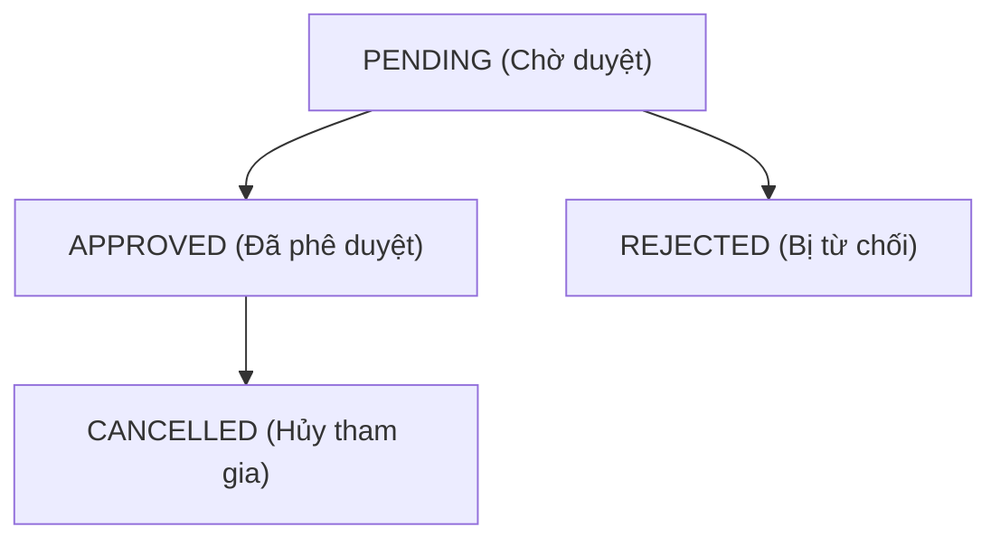

# Tài liệu Phân tích Nghiệp vụ (BRD): Đăng ký và Quản lý Đăng ký Hackathon

Tài liệu này đặc tả các yêu cầu nghiệp vụ, luồng trải nghiệm người dùng (User Flows), ràng buộc hệ thống và đề xuất thiết kế kỹ thuật cho tính năng **Đăng ký tham gia** và **Quản lý đăng ký** trong phân hệ Hackathons của hệ thống DUT AI Quiz.

---

## 1. Đối tượng sử dụng (User Personas)

1. **Sinh viên (Người tham gia):** Có nhu cầu tìm kiếm giải đấu, đăng ký thi đấu cá nhân hoặc thành lập/tham gia đội nhóm và theo dõi trạng thái đăng ký của mình.
2. **Giảng viên / Admin (Người quản lý):** Thiết lập cấu hình đăng ký, phê duyệt/từ chối danh sách đăng ký của sinh viên, theo dõi số lượng và xuất danh sách thí sinh dự thi.

---

## 2. Các hình thức đăng ký thi đấu

Dựa trên cấu hình `participation_mode` (`individual`, `team`, `both`) của Hackathon, hệ thống sẽ mở các hình thức tương ứng:

### A. Đăng ký Cá nhân (Individual Registration)
* Áp dụng khi `participation_mode` là `individual` hoặc `both`.
* **Quy trình:**
  1. Sinh viên nhấn nút "Đăng ký cá nhân".
  2. Hệ thống kiểm tra điều kiện đăng ký (thời hạn, sự trùng lặp).
  3. Tạo bản ghi đăng ký cá nhân với trạng thái mặc định (thường là `APPROVED` hoặc `PENDING` tùy cấu hình duyệt).

### B. Đăng ký Đội nhóm (Team Registration)
* Áp dụng khi `participation_mode` là `team` hoặc `both`.
* Gồm 2 vai trò trong đội: **Trưởng nhóm (Leader)** và **Thành viên (Member)**.
* **Quy trình dành cho Trưởng nhóm:**
  1. Chọn "Tạo đội thi mới".
  2. Nhập **Tên đội** (bắt buộc, không trùng lặp trong cùng một Hackathon).
  3. Hệ thống tạo đội mới, gán Sinh viên này làm Leader, sinh ra một **Mã đội (Team Code)** duy nhất (ví dụ: `AI-2026-X8Y9`).
  4. Trưởng nhóm nhận Mã đội và gửi trực tiếp mã này cho các thành viên khác để họ tự gia nhập.
* **Quy trình dành cho Thành viên:**
  1. Chọn "Tham gia đội có sẵn".
  2. Nhập **Mã đội** được chia sẻ.
  3. Hệ thống kiểm tra giới hạn thành viên của đội và tiến hành thêm thành viên vào đội.

---

## 3. Quy tắc Ràng buộc Nghiệp vụ (Business Rules & Constraints)

1. **Giới hạn số lượng tham gia:** Mỗi sinh viên chỉ được phép đăng ký thi đấu dưới **tối đa 1 hình thức** (Cá nhân hoặc thuộc 1 Đội nhóm duy nhất) trong cùng một Hackathon.
2. **Thời hạn đăng ký:** Nút đăng ký chỉ hiển thị khi Hackathon ở trạng thái "Sắp diễn ra" (Upcoming) và thời gian hiện tại nằm trước Hạn đăng ký (hoặc trước thời gian bắt đầu Hackathon).
3. **Giới hạn thành viên đội:** Cấu hình mặc định cho mỗi đội (ví dụ: tối thiểu 2 thành viên, tối đa 5 thành viên). Trưởng nhóm không thể bấm nút "Gửi đăng ký chính thức" hoặc chốt danh sách nếu số lượng thành viên chưa đạt tối thiểu.
4. **Hủy đăng ký / Rời đội:**
   - Cá nhân có thể hủy đăng ký trước hạn đăng ký.
   - Thành viên có thể rời đội (hoặc Leader kích thành viên) trước khi danh sách đội được chốt/phê duyệt.
   - Nếu Leader rời đội, Leader bắt buộc phải chỉ định một thành viên khác trong đội làm Leader mới. Nếu đội không còn ai khác, đội sẽ tự động giải tán.

---

## 4. Vòng đời Trạng thái Đăng ký (Status Lifecycle)

Đơn đăng ký (Cá nhân hoặc Đội thi) sẽ trải qua các trạng thái sau:

* **`PENDING` (Chờ duyệt):** Trạng thái ban đầu sau khi đăng ký (hoặc khi đội nhóm chưa đủ thành viên tối thiểu/chưa được Leader chốt).
* **`APPROVED` (Đã duyệt):** Đã chính thức được tham gia Hackathon. Sinh viên sẽ được cấp quyền truy cập các đề thi/bài tập của Hackathon khi giải đấu bắt đầu.
* **`REJECTED` (Từ chối):** Đơn đăng ký bị hủy bỏ bởi Admin/Giảng viên (kèm lý do, ví dụ: thông tin không hợp lệ).
* **`CANCELLED` (Đã hủy):** Sinh viên chủ động hủy đăng ký hoặc giải tán đội trước thời hạn thi đấu.

---

## 5. Đề xuất Thiết kế Kỹ thuật (Technical Design Proposal)

### A. Cấu trúc Cơ sở dữ liệu (Database Schema)

Để đáp ứng các nghiệp vụ trên, cần bổ sung 2 bảng mới: `hackathon_teams` và `hackathon_registrations`.

#### Bảng `hackathon_teams` (Đội thi)
Lưu trữ thông tin đội thi và tạo mã mời thành viên.

| Tên cột | Kiểu dữ liệu | Ràng buộc | Mô tả |
| :--- | :--- | :--- | :--- |
| `id` | `UUID` | Primary Key | ID của đội |
| `hackathon_id` | `UUID` | Foreign Key | Liên kết với bảng `hackathons` |
| `name` | `VARCHAR` | NOT NULL | Tên đội |
| `code` | `VARCHAR` | Unique | Mã mời tham gia đội (ví dụ: `TEAM-XXXX`) |
| `leader_id` | `INTEGER` | Foreign Key | ID của sinh viên làm trưởng nhóm |
| `created_at` | `TIMESTAMP` | Default NOW | Thời gian tạo đội |

#### Bảng `hackathon_registrations` (Lịch sử Đăng ký)
Lưu trữ thông tin đăng ký của cá nhân hoặc đội nhóm.

| Tên cột | Kiểu dữ liệu | Ràng buộc | Mô tả |
| :--- | :--- | :--- | :--- |
| `id` | `UUID` | Primary Key | ID đăng ký |
| `hackathon_id` | `UUID` | Foreign Key | Liên kết với bảng `hackathons` |
| `user_id` | `INTEGER` | Foreign Key (Nullable) | ID sinh viên (nếu đăng ký cá nhân) |
| `team_id` | `UUID` | Foreign Key (Nullable) | ID đội thi (nếu đăng ký đội nhóm) |
| `status` | `VARCHAR` | Default 'PENDING' | Trạng thái (`PENDING`, `APPROVED`, `REJECTED`, `CANCELLED`) |
| `registered_at` | `TIMESTAMP` | Default NOW | Thời gian đăng ký |
| `reviewed_by` | `INTEGER` | Foreign Key (Nullable) | Giảng viên thực hiện phê duyệt |
| `rejection_reason`| `VARCHAR` | Nullable | Lý do từ chối |

* **Ràng buộc duy nhất (Unique Constraints):**
  - Ràng buộc: `Unique(hackathon_id, user_id)` để đảm bảo 1 user chỉ có 1 đăng ký cá nhân trên 1 hackathon.
  - Cần thêm cơ chế kiểm tra (Trigger hoặc Application level validation) để đảm bảo nếu user đã nằm trong một `hackathon_team` của hackathon đó, họ không thể tạo thêm bản ghi đăng ký cá nhân.

---

### B. Danh sách API Endpoints đề xuất

#### 1. Dành cho Sinh viên (Đăng ký)
* `POST /api/v1/hackathons/{id}/register/individual`: Đăng ký tham gia với tư cách cá nhân.
* `POST /api/v1/hackathons/{id}/register/team/create`: Trưởng nhóm tạo đội mới (trả về `team_id` và `code`).
* `POST /api/v1/hackathons/{id}/register/team/join`: Nhập `code` để xin gia nhập đội.
* `POST /api/v1/hackathons/{id}/register/team/leave`: Rời khỏi đội hiện tại.
* `DELETE /api/v1/hackathons/{id}/register/cancel`: Hủy đăng ký cá nhân / giải tán đội thi.

#### 2. Dành cho Giảng viên (Quản lý)
* `GET /api/v1/hackathons/{id}/registrations`: Xem toàn bộ danh sách đăng ký (lọc theo Trạng thái, Cá nhân/Đội nhóm).
* `POST /api/v1/hackathons/{id}/registrations/{reg_id}/approve`: Phê duyệt đăng ký.
* `POST /api/v1/hackathons/{id}/registrations/{reg_id}/reject`: Từ chối đăng ký (nhập `rejection_reason`).
* `GET /api/v1/hackathons/{id}/registrations/export`: Xuất file danh sách thí sinh đủ điều kiện dự thi (Excel/CSV).
